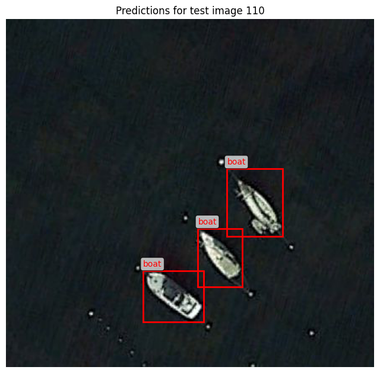
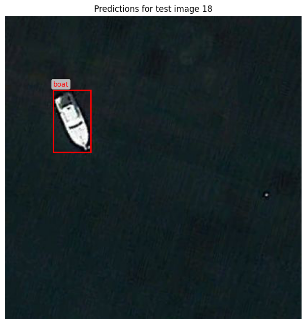

# Boat Detection in Satellite Imagery with YOLOv8

This project implements a YOLOv8-based object detection pipeline to identify boats in satellite imagery.  
The dataset is provided as NumPy arrays with normalized bounding boxes and is converted into the YOLO format before training.  
A custom YOLOv8n model is then fine-tuned on this dataset and evaluated through both CSV predictions and qualitative visualizations.

## Overview

- Converted the raw dataset into the YOLO folder structure  
- Exported normalized labels in standard YOLO format  
- Fine-tuned a YOLOv8n model on the custom boat dataset  
- Generated predictions for the test set (`predictions.csv`)  
- Visualized detections on unseen test images  

This notebook can be used as a clear reference for training YOLO models on small custom datasets.

## Sample Predictions

Below are examples of the fine-tuned model detecting boats in satellite imagery:

### Example 1

### Example 2

The model performs well across different scales and orientations, including small boats and cluttered backgrounds.
